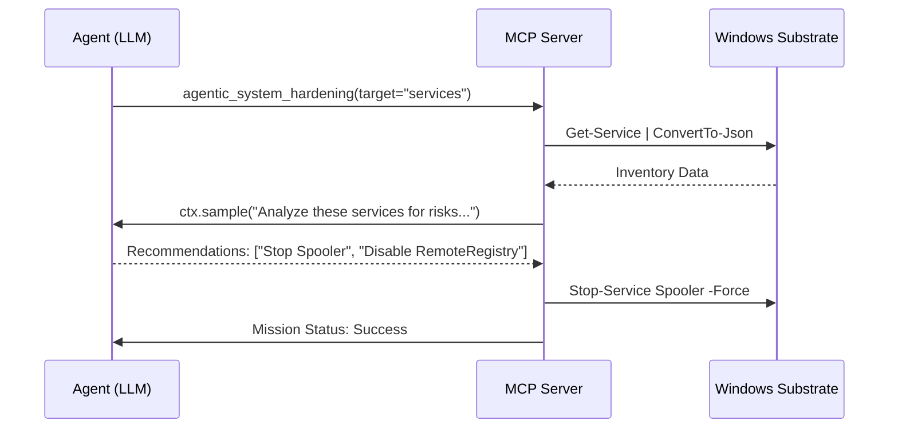

# Agentic System Workflows (SOTA v14.0)

This document details the autonomous orchestration capabilities of the **Windows Operations MCP** platform.

## 🧠 SOTA v14.0 Agentic Architecture

The transition to **FastMCP 3.2** introduces a native `Context` paradigm that enables "Autonomous Missions"—complex, multi-step operations coordinated by the server and LLM in tandem.

### 🛡️ Mission: System Hardening
The `agentic_system_hardening` tool provides a baseline for autonomous security operations.

## 🛠️ Integrated Capabilities

### 1. Autonomous Sampling (`ctx.sample()`)
Core tools like `command_execution` and `file_operations` now use **sampling** to resolve ambiguous errors. If a PowerShell command fails, the server can automatically request a fix from the LLM based on the error output.

### 2. Real-time Telemetry (`ctx.report_progress()`)
All long-running missions provide incremental feedback to the host application, ensuring the user or orchestrator remains informed of the current phase (e.g., Inventory, Audit, Hardening).

### 3. Expert Guidance (`skill://windows-expert`)
The skill system provides the "Heuristic Substrate" for missions. It contains:
- **Safety Protocols**: Mandatory validation steps before destructive actions.
- **Diagnostic Tips**: Recommended event log queries for specific failures.
- **Aesthetics**: Coding and command standards for industrial-grade ops.

## 🚀 Future Roadmap: SOTA v15.0
- **Fleet-wide Coordination**: Cross-server missions (e.g., coordinating between `windows-ops` and `docker-mcp`).
- **Autonomous Remediation**: Fully unsupervised background "Sentinel" tasks.
- **Deep Memory Support**: Persisting mission outcomes to `docs-mcp` for long-term audit trails.

---
**Advanced Agentic Coding Platform**  
*SOTA v14.0 - GA April 2026*
